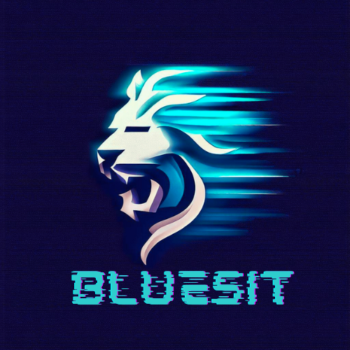

<!-- [![Followers][followers-shield]][followers-url]
[![Stargazers][stars-shield]][stars-url] -->

<!-- PROJECT LOGO -->
 

  

<h3 align="center">Kevin Giesbrecht</h3>

  

    Full-Stack Web Developer
     
    <!-- <a href="https://github.com/bluesit"><strong>Website »</strong></a>
      -->

<!-- TABLE OF CONTENTS -->

  
TABLE OF CONTENTS

  <ol>
    <li><a href="#about-me">ABOUT ME</a></li>
    <li><a href="#my-skill-set">MY SKILL SET</a></li>
    <li><a href="#contact">CONTACT</a></li>
  </ol>

<!-- ABOUT THE PROJECT -->
## ABOUT ME

Hi, My name is Kevin Giesbrecht. I am a full-stack web developer and I have a passion for creating web applications that are user-friendly, responsive, and functional. I am always eager to learn new things and improve my skills. You can check out my github profile (Bluesit) to see some of my work and contact me if you want to collaborate or chat.

(<a href="#readme-top">back to top</a>)

## MY SKILL SET

[![JavaScript][Javascript]][Javascript-url]

[![Vue][Vue.js]][Vue-url]

[![HTML][html]][html-url]

[![css][css]][css-url]

[![scss][scss]][scss-url]

[![Bootstrap][Bootstrap.com]][Bootstrap-url]

<!-- [![java][java]][java-url] -->

[![spring boot][spring boot]][spring boot-url]

[![golang][golang]][golang-url]

[![nodejs][nodejs]][nodejs-url]

[![postgresql][postgresql]][postgresql-url]

[![mysql][mysql]][mysql-url]

(<a href="#readme-top">back to top</a>)

<!-- CONTACT -->
## Contact

[![Mail][mail-shield]][mail-url]
[![LinkedIn][linkedin-shield]][linkedin-url]
[![Youtube][youtube-shield]][youtube-url]
[![Twitter][twitter-shield]][twitter-url]

(<a href="#readme-top">back to top</a>)

<!-- ACKNOWLEDGMENTS -->
<!-- ## Acknowledgments

* 
* 
* 

(<a href="#readme-top">back to top</a>)
 -->

<!-- links -->

[stars-shield]: https://img.shields.io/github/stars/bluesit?style=for-the-badge&logo=github&color=%23ffee00
[stars-url]: https://github.com/bluesit/bluesit/stargazers
[followers-shield]: https://img.shields.io/github/followers/bluesit?style=for-the-badge&logo=github&color=green
[followers-url]: https://github.com/bluesit

[product-screenshot]: images/screenshot.png

<!-- skills -->
[Vue.js]: https://img.shields.io/badge/Vue.js-42b883?style=for-the-badge&logo=vuedotjs&labelColor=3c444d
[Vue-url]: https://vuejs.org/
[JavaScript]:https://img.shields.io/badge/javascript-f0db4f?style=for-the-badge&logo=javascript&labelColor=323330
[Javascript-url]:https://developer.mozilla.org/en-US/docs/Web/javascript
[html]:https://img.shields.io/badge/HTML-e34c26?style=for-the-badge&logo=html5&labelColor=ebebeb
[postgresql]:https://img.shields.io/badge/PostgreSQL-blue?style=for-the-badge&logo=postgresql&labelColor=ebebeb
[postgresql-url]:https://www.postgresql.org/
[mysql]:https://img.shields.io/badge/MySQL-blue?style=for-the-badge&logo=mysql&labelColor=ebebeb
[mysql-url]:https://www.mysql.com/
[java]:https://img.shields.io/badge/java-blue?style=for-the-badge&logo=java&labelColor=ebebeb
[java-url]:https://www.java.com/
[spring boot]:https://img.shields.io/badge/Spring_Boot-6db33f?style=for-the-badge&logo=spring-boot&labelColor=white
[spring boot-url]:https://spring.io/projects/spring-boot
[golang]:https://img.shields.io/badge/Golang-2dbbb1?style=for-the-badge&logo=go&labelColor=ebebeb
[golang-url]:https://golang.org/
[nodejs]:https://img.shields.io/badge/Node.js-679e5f?style=for-the-badge&logo=node.js&labelColor=ebebeb
[nodejs-url]:https://nodejs.org/es/
[css]:https://img.shields.io/badge/CSS-blue?style=for-the-badge&logo=css3&logoColor=blue&labelColor=ebebeb
[css-url]:https://developer.mozilla.org/es/docs/Web/CSS
[scss]:https://img.shields.io/badge/Sass-cc6699?style=for-the-badge&logo=sass&labelColor=ebebeb
[scss-url]:https://sass-lang.com/
[html-url]:https://developer.mozilla.org/es/docs/Web/HTML
[Bootstrap.com]: https://img.shields.io/badge/Bootstrap-7c08f0?style=for-the-badge&logo=bootstrap&labelColor=ebebeb
[Bootstrap-url]: https://getbootstrap.com

<!--Social Media-->
[twitter-shield]: https://img.shields.io/badge/xbluesit-black?style=for-the-badge&logo=x
[twitter-url]: https://twitter.com/XBluesit
[mail-shield]: https://img.shields.io/badge/kevingie01%40gmail.com-black?style=for-the-badge&logo=gmail&logoColor=white
[mail-url]: mailto:kevingie01@gmail.com
[youtube-shield]:https://img.shields.io/badge/-YouTube-black?logo=youtube&style=for-the-badge&logoColor=white
[youtube-url]: https://www.youtube.com/@bluesit
[linkedin-shield]: https://img.shields.io/badge/-LinkedIn-black.svg?style=for-the-badge&logo=linkedin
[linkedin-url]: https://www.linkedin.com/in/kevin-giesbrecht-448b09252/